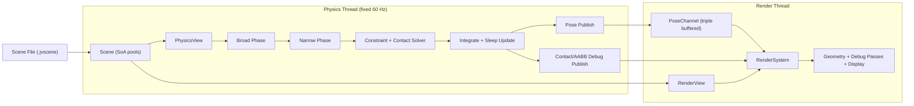

# Javelin

Javelin is a lightweight, data-oriented rigid body physics sandbox focused on clear code, explicit contracts, and predictable behavior. The project is built as a portfolio-grade engine core: fast enough for large scenes, readable enough to extend.

## Project Goals

1. Keep the simulation pipeline explicit and debuggable.
2. Prefer simple SoA data flow over hidden object graphs.
3. Make feature tradeoffs visible (what is intentionally included and excluded).

## Feature Set

- Fixed-step physics thread at 60 Hz (`PhysicsSystem`) with deterministic stage ordering.
- SoA scene storage (`Scene`) shared through explicit views (`PhysicsView`, `RenderView`).
- Broad phase and narrow phase contact generation for sphere/box collisions.
- Iterative impulse solver with friction, restitution, and warm starting.
- Per-material friction/restitution through scene-authored `physics_material` records.
- Body sleeping with per-body timers and explicit wake-up rules.
- Distance constraints (XPBD-style compliance).
- Triple-buffered pose channel for render interpolation.
- Debug visualization channels and passes (contacts, AABBs, velocity vectors, sleep-state coloring).
- ImGui control UI with simulation controls, debug toggles, performance stats, and scene info.
- Text scene format (`.jvscene`) and scene round-trip tooling.

## Intentionally Excluded (Current Scope)

- Continuous collision detection (CCD)
- Capsule shapes
- Joint types beyond distance constraints
- Soft bodies
- Fluids
- Networked rollback/replication

## Quick Start

```bash
just configure && just build && just run
```

## Architecture Overview



## Scene Demos

- `assets/scenes/samples/newtons_cradle.jvscene`
- `assets/scenes/samples/domino_chain.jvscene`
- `assets/scenes/samples/slope_friction.jvscene`
- `assets/scenes/samples/pyramid_topple.jvscene`
- `assets/scenes/samples/stack_boxes.jvscene`

## Screenshots / GIFs

Capture media should be kept under `docs/media/` and linked from this section for portfolio review.

- `docs/media/newtons_cradle.gif`
- `docs/media/domino_chain.gif`
- `docs/media/slope_friction.png`
- `docs/media/pyramid_topple.gif`

## Testing

Enable tests and run:

```bash
cmake -S . -B build/dev -G Ninja -DJAVELIN_ENABLE_TESTS=ON
cmake --build build/dev
ctest --test-dir build/dev --output-on-failure
```

Current minimal coverage includes:

- `sphere_sphere_contact`
- `box_box_sat`
- `solve_contact_velocities`

## Known Limitations

- No CCD: very fast bodies can tunnel.
- Ground is a built-in infinite plane at `y=0` (intentional simplification).
- Constraint set is intentionally narrow (distance only).
- No guarantee of bitwise deterministic replay across different compilers/CPUs.
- No editor/runtime hot-reload pipeline for authored assets.
